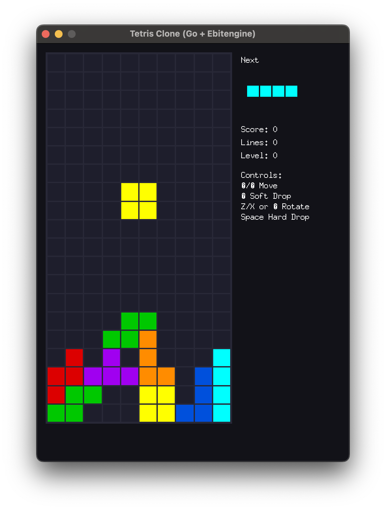

# Tetris Clone (Go + Ebitengine)



A simple Tetris-style game written in Go using Ebitengine. Works on desktop and iOS.

Features:
- 10x20 board, 7-bag randomization
- Rotation with simple wall kicks
- Line clears, scoring, levels
- Next-piece preview
- Keyboard (desktop) and on-screen touch controls (mobile)

## Requirements

- Go 1.24+
- Modules:
  - github.com/hajimehoshi/ebiten/v2
  - golang.org/x/image

Run `go mod tidy` if needed.

## Run on Desktop

```bash
go run main.go
```